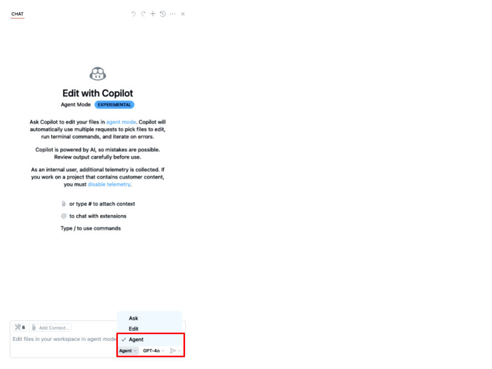

## Step 2: The initial application setup: Directory structure, Python requirements, Django project/app, and MongoDB

In this step, we will accomplish the following:

- Create the octofit-tracker application directory structure.
- Create the octofit-tracker/backend and octofit-tracker/frontend directories.
- Create the octofit-tracker/backend/requirements.txt file.

1. Open all files in the `docs` folder and keep this file open in the editor.
2. Click the GitHub Copilot Chat click the :paperclip: and add "Open Editors" to the prompt.
3. Copy and paste the following prompt in the GitHub Copilot Chat and select the "Agent" instead of "Ask" or "Edit" from the drop down where you are inserting the prompt.



>[!NOTE]
> Do not change the model from GPT-4o this will be an optional activity at the end of the course.
> Keep in mind that the Copilot agent mode is conversational so it may ask you questions and you can ask it questions too.
> Wait a moment for the Copilot to respond and press the continue button to execute commands presented by Copilot agent mode.
> Keep files created and updated by Copilot agent mode until it is finished.
> Agent mode has the ability to evaluate your code base and execute commands and add/refactor/delete parts of your code base and automatically self heal if it or you makes a mistake in the process.

### :keyboard: Activity: Prompt for GitHub Copilot in agent mode to start the creation of our application

> **Prompt**
>
> ```prompt
> Let's take the following step by step and generate instructions in this order and execute the commands.
> Use docs/mona-high-school-fitness-tracker.md as a guide for the project structure and requirements.
>
> 1. Understand the story of creating the fitness application from the docs/octofit_story.md file.
> 2. Create the initial directory structure for the octofit-tracker application octofit-tracker/backend, octofit-tracker/frontend.
> 3. Setup the backend python virtual environment, requirements.txt based on docs/mona-high-school-fitness-tracker.md, and install required packages.
>
> Don't proceed with the next activity until all of these steps are completed.
>```
>
> [!IMPORTANT]
> Once the above activity installs all the required packages, proceed to the next activity.

### :keyboard: Activity: Setup the Python Django project/app

> **Prompt**
>
> ```prompt
> Based on the example monafit tracker app in the docs/mona-high-school-fitness-tracker.md file and use octofit as the name for mergington's high schools app,  > let's setup the Python Django project/app and run the server.
>
> 1. The octofit-tracker/backend directory will store the django project and app with the name octofit-tracker.
> 2. Setup the additional configuration for the django project/app with the name octofit-tracker.
>
> Don't proceed with the next activity until all of these steps are completed.
>```

Wait a moment for the Copilot to respond and press the continue button to execute each command presented by Copilot agent mode.
Keep files creating and updating until the Copilot agent mode has finished.

### :keyboard: Activity: Let's install mongoDB

> **Prompt**
>
> ```prompt
> Based on the example monafit tracker app in the docs/mona-high-school-fitness-tracker.md file and use octofit as the name for mergington's high schools app. > Let's install mongoDB.
>
> 1. Install mongoDB and make sure the command is complete.
>
> Don't proceed with the next activity until all of these steps are completed.
>```

> [!IMPORTANT]
> If the command completes in the terminal but agent mode shows it is still running click stop.
> You may need to paste the prompt again in agent mode.

### :keyboard: Activity: Let's start and verify mongoDB is running

> **Prompt**
>
> ```prompt
> Based on the example monafit tracker app in the docs/mona-high-school-fitness-tracker.md file and use octofit as the name for mergington's high schools app. > Let's start and verify mongoDB is running.
>
> 1. Start the mongoDB service.
> 2. Verify the mongoDB service running.
>
> Don't proceed with the next activity until all of these steps are completed.
>```

> [!NOTE]
> You may not need to run this step if it was already started in the previous step.

> [!IMPORTANT]
> If the command completes in the terminal but agent mode shows it is still running click stop.
> You may need to paste the prompt again in agent mode.

## Next step

Now that the application structure and initial setup is complete, let's continue on to the next step [Step 3: Database and Django Project Setup](./3-database-django-project-setup.md)
