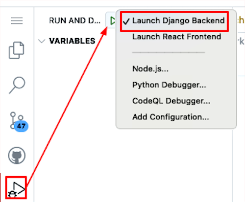
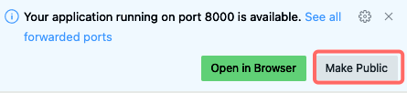

## Step 4: Setup django REST Framework, restart the server, and test the API

In this step, we will will accomplish the following:

- Setup the django REST Framework.
- Restart the server.
- Test the API using curl.

1. Open all files in the `docs` folder and keep this file open in the editor.
2. Click the GitHub Copilot Chat click the :paperclip: and add "Open Editors" to the prompt.
3. Copy and paste the following prompt in the GitHub Copilot Chat and select the "Agent" instead of "Ask" or "Edit" from the drop down where you are inserting the prompt.

>[!NOTE]
> Do not change the model from GPT-4o this will be an optional activity at the end of the course.
> Keep in mind that the Copilot agent mode is conversational so it may ask you questions and you can ask it questions too.
> Wait a moment for the Copilot to respond and press the continue button to execute commands presented by Copilot agent mode.
> Keep files created and updated by Copilot agent mode until it is finished.
> Agent mode has the ability to evaluate your code base and execute commands and add/refactor/delete parts of your code base and automatically self heal if it or you makes a mistake in the process.

### :keyboard: Activity: Setup django REST Framework, restart the server, and test the API

> [!NOTE]
> Make sure to replace [REPLACE-THIS-WITH-YOUR-CODESPACE-NAME] with your codespace name.
> ex. redesigned-spork-g6pj46rr9hpp6x
> You can get the codespace name by running the following command in the terminal: `echo $CODESPACE_NAME`
>
> **Prompt**
>
> ```prompt
>Based on the example monafit tracker app in the docs/mona-high-school-fitness-tracker.md file and use octofit as the name for mergington's high schools app. > Let's setup codespace for the url, restart the server, and test the API.
> 
> 1. Activate the python virtual environment.
> 2. Update #file:octofit-tracker/backend/octofit_tracker/views.py to replace the return for the rest api url endpoints with the codespace url https://[REPLACE-THIS-WITH-YOUR-CODESPACE-NAME]-8000.app.github.dev for django and avoid certificate HTHS issues.
> 3. Make sure the django backend works on [REPLACE-THIS-WITH-YOUR-CODESPACE-NAME]-8000.app.github.dev and localhost:8000.
> 4. Test the API end points using curl command.
> 5. Allow host access to codespace url and localhost:8000.
>
> Don't proceed with the next activity until all of these steps are completed.
>```

Now, let's actually try running the Django application! In the left sidebar, select the `Run and Debug` tab and then press the **Start Debugging** icon.



>[!IMPORTANT]
> Make sure to replace [REPLACE-THIS-WITH-YOUR-CODESPACE-NAME] with your codespace name.
> ex. redesigned-spork-g6pj46rr9hpp6x
> You can get the codespace name by running the following command in the terminal: `echo $CODESPACE_NAME`
> Make sure the pop-up shows to open the browser to also choose to make it public.



## Next step

Now that the Django REST framework is setup, let's continue on to the next step [Step 5: Setup the React Frontend Framework](./5-setup-frontend-react-framework.md)
