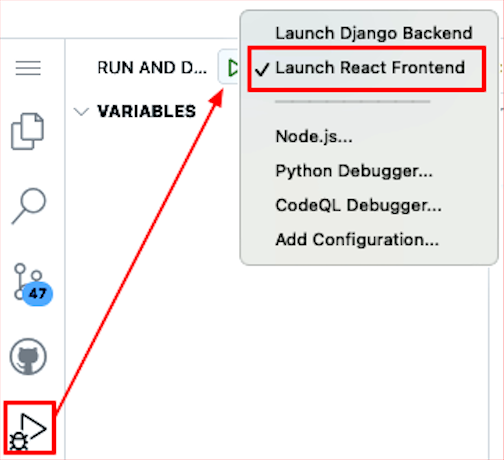

## Step 5: Setup the frontend React framework, update the components, and start OctoFit Tracker app

In this step, we will will accomplish the following:

- Setup the octofit-tracker frontend React framework.
- Update the folowing components to include the React framework:
  - src/App.js
  - src/index.js
  - src/components/Activities.js
  - src/components/Leaderboard.js
  - src/components/Teams.js
  - src/components/Users.js
  - src/components/Workouts.js
- Start the react app and check the output.

1. Open all files in the `docs` folder and keep this file open in the editor.
2. Click the GitHub Copilot Chat click the :paperclip: and add "Open Editors" to the prompt.
3. Copy and paste the following prompt in the GitHub Copilot Chat and select the "Agent" instead of "Ask" or "Edit" from the drop down where you are inserting the prompt.

>[!NOTE]
> Do not change the model from GPT-4o this will be an optional activity at the end of the course.
> Keep in mind that the Copilot agent mode is conversational so it may ask you questions and you can ask it questions too.
> Wait a moment for the Copilot to respond and press the continue button to execute commands presented by Copilot agent mode.
> Keep files created and updated by Copilot agent mode until it is finished.
> Agent mode has the ability to evaluate your code base and execute commands and add/refactor/delete parts of your code base and automatically self heal if it or you makes a mistake in the process.

### :keyboard: Activity: Install the octofit-tracker frontend React framework

> **Prompt**
>
> ```prompt
> Based on the example monafit tracker app in the docs/mona-high-school-fitness-tracker.md file and use octofit as the name for mergington's high schools app. Let's setup codespace for the octofit-tracker frontend React framework.
>
> 1. Make the octofit-tracker/frontend directory.
> 2. Create the react app in the octofit-tracker/frontend directory.
> 3. Install bootstrap in the octofit-tracker/frontend directory.
> 4. Import bootstrap css in the src/index.js file.
> 5. Install the reactor-router-dom in the octofit-tracker/frontend directory.
>
> Don't proceed with the next activity until all of these steps are completed.
>```

### :keyboard: Activity: Update the octofit-tracker frontend React components

> **Prompt**
>
> ```prompt
> Based on the example monafit tracker app in the docs/mona-high-school-fitness-tracker.md file and use octofit as the name for mergington's high schools app. Let's update the octofit-tracker frontend React components.
>
> - Update the folowing components to include the React framework to point to the backend API:
>   - src/App.js
>   - src/index.js
>   - src/components/Activities.js
>   - src/components/Leaderboard.js
>   - src/components/Teams.js
>   - src/components/Users.js
>   - src/components/Workouts.js
> - In each compenent replace the fetch url with the codespace url [REPLACE-THIS-WITH-YOUR-CODESPACE-NAME] for the Django rest framework backend.
> - Make sure to use the correct port and protocol http or https.
> - Update src/App.js to include the main navigation for all components.
> - Make sure react-router-dom is used for the navigation menu.
> - The react app should show the navigation menu and the components.
>
> Don't proceed with the next activity until all of these steps are completed.
> ```

### :keyboard: Activity: Start the react app and check the output

Now, let's actually try running the react application! In the left sidebar, select the `Run and Debug` tab and then press the **Start Debugging** icon.



### :keyboard: Activity: Let's add some formatting, structuring, and styling to the octofit tracker app

> **Prompt**
>
> ```prompt
> Based on the example monafit tracker app in the docs/mona-high-school-fitness-tracker.md file and use octofit as the name for mergington's high schools app. Let's style this like App.css and make it look nice.
>
> - Let's make the App.js and all components javascript files in the app are consistent with the following:
>   - Use bootstrap tables for the data in all javascript components.
>   - Use bootstrap buttons for the buttons.
>   - Use bootstrap headings for the headings.
>   - Use bootstrap links for the links.
>   - Use bootstrap navigation for the navigation menu.
>   - Use bootstrap forms for the forms.
>   - Use bootstrap cards for the cards.
>   - Use bootstrap modals for the modals.
>
> Don't proceed with the next activity until all of these steps are completed.
>```

### :keyboard: Activity: Let's make the octofit tracker app look nice, pretty, and add some color

> **Prompt**
>
> ```prompt
> Based on the example monafit tracker app in the docs/mona-high-school-fitness-tracker.md file and use octofit as the name for mergington's high schools app. Let's style this like App.css and make it look nice.
> 
> -  Edit the App.css file to do the following:
>   - Add some color to the background.
>   - Add some color to the text.
>   - Add some color to the tables.
>   - Add some color to the buttons.
>   - Add some color to the headings.
>   - Add some color to the links.
>   - Add some color to the navigation menu.
> - Add the octofitapp-small logo justified to the left to the app and make it look nice.
> - Add a favicon to the app and make it look nice.
>
>Don't proceed with the next activity until all of these steps are completed.
>```

### :keyboard: Optional Activity: Iterate on the appearance and try different models

>[!NOTE]
> Try creating your own prompts to change the application appearance, add features, and try different models.
> Once you are happy with the application you can commit the changes and push them to your branch `build-octofit-app`.
